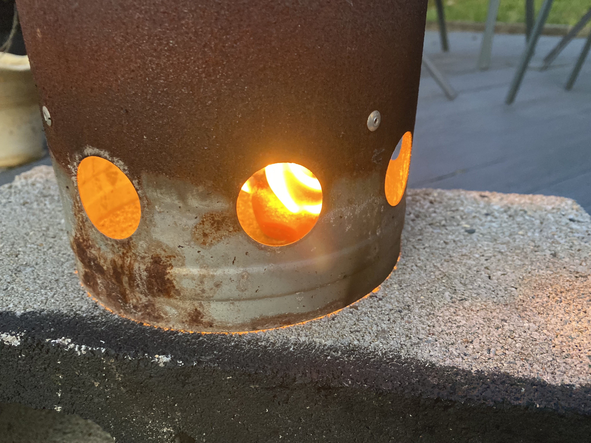
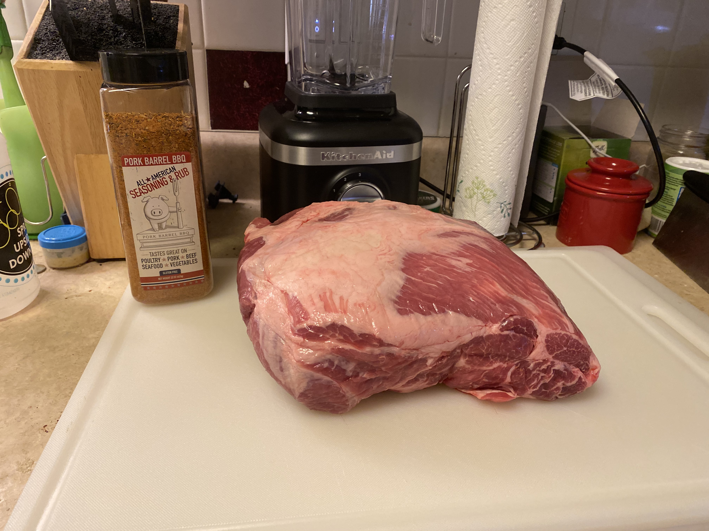
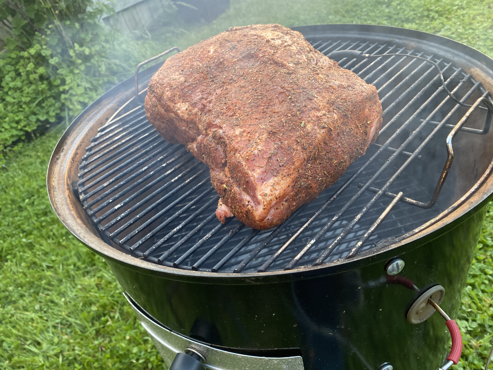
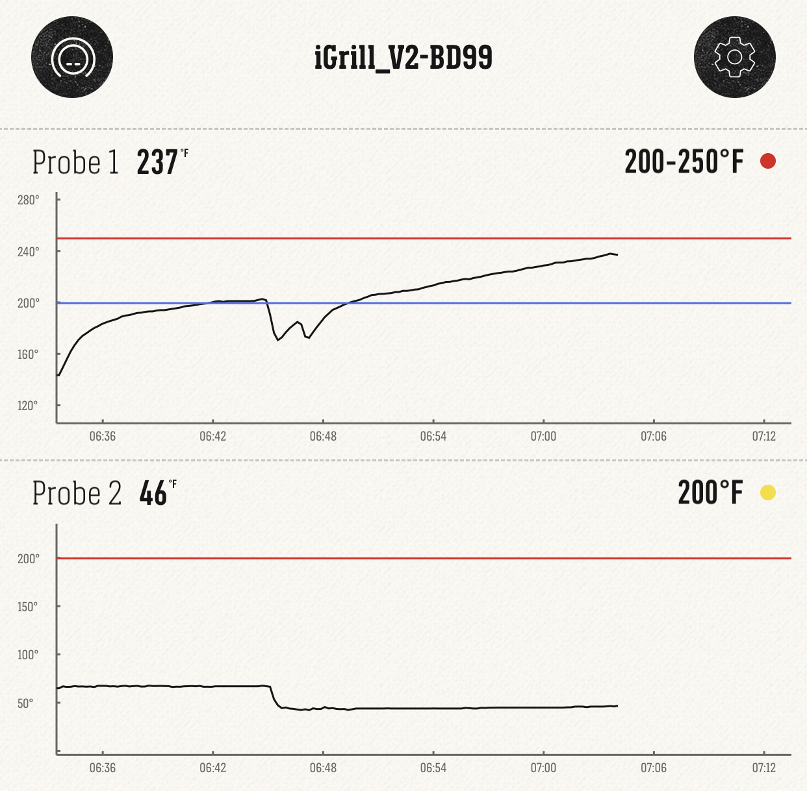
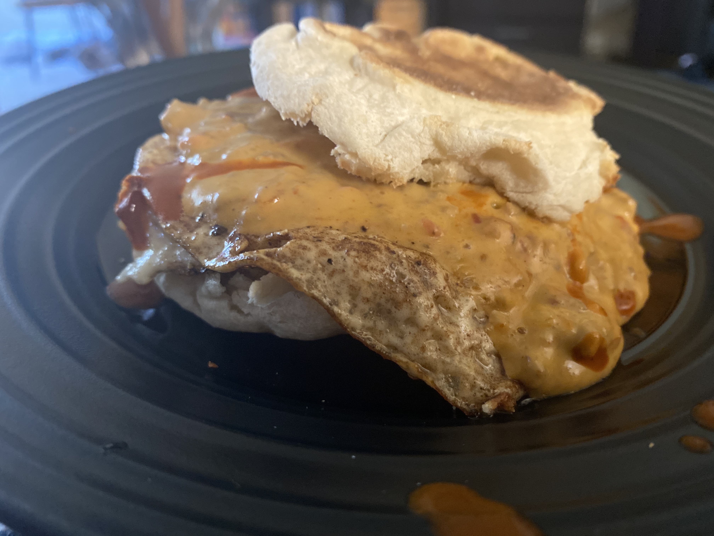
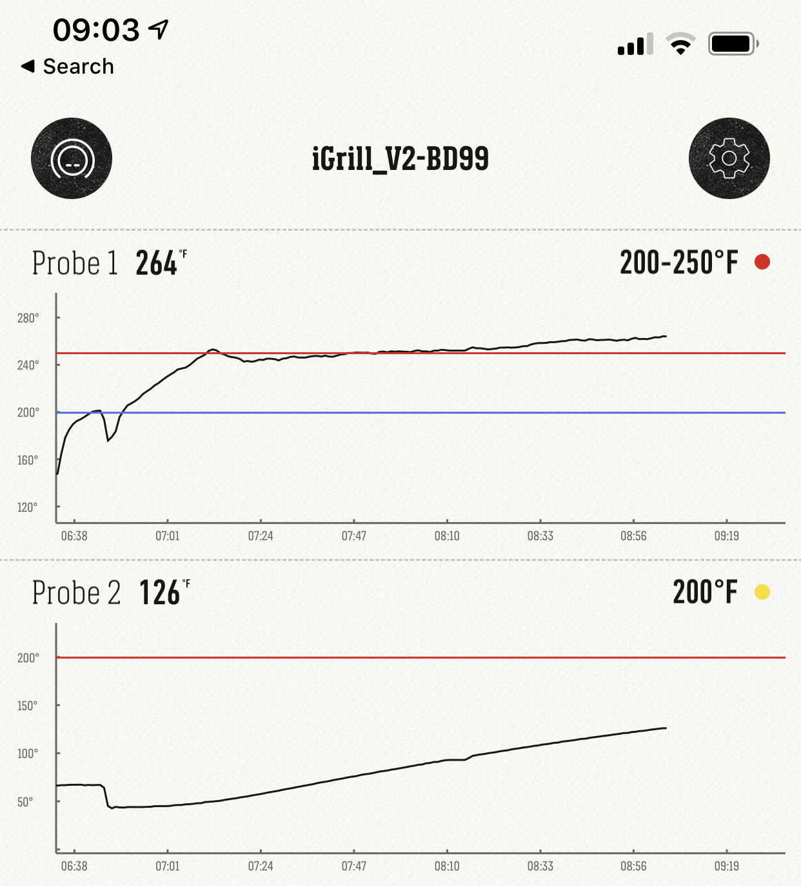
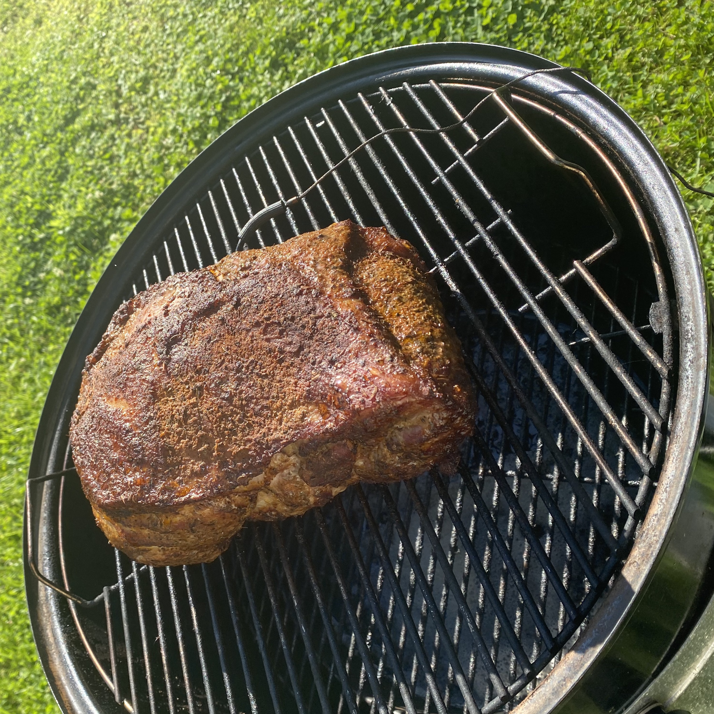
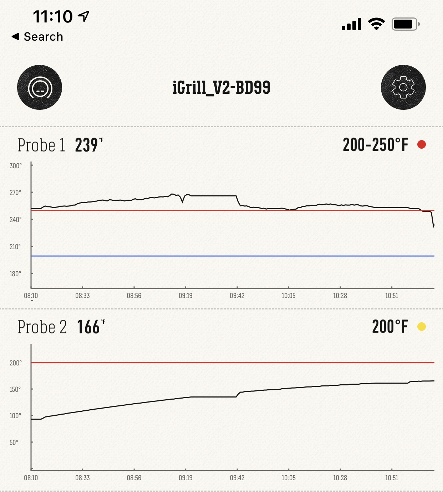
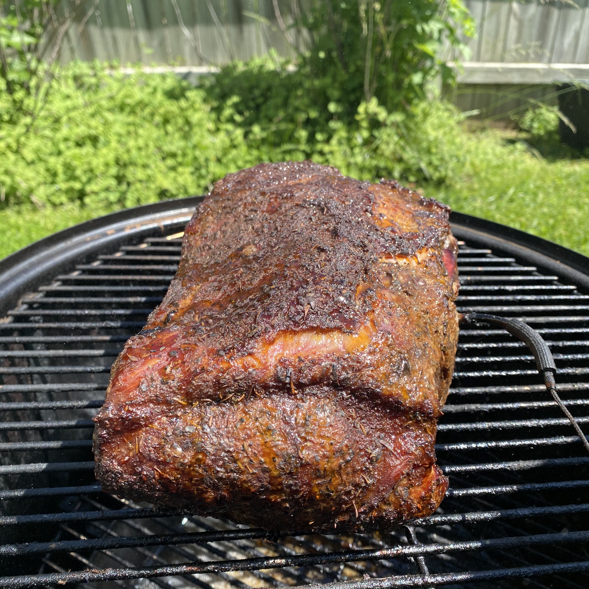

= Pork!

* link:00_smoker_built.jpeg[00_smoker_built.jpeg]
+
[link=00_smoker_built.jpeg]
image::00_smoker_built.jpeg[width=500]
* link:01_my_homemade_starter_bricks.jpeg[01_my_homemade_starter_bricks.jpeg]
+
[link=01_my_homemade_starter_bricks.jpeg]

* link:02_the_pork.jpeg[02_the_pork.jpeg]
+
[link=02_the_pork.jpeg]

* link:03_pork_goes_on.jpeg[03_pork_goes_on.jpeg]
+
[link=03_pork_goes_on.jpeg]

* link:04_temp_at_700.jpeg[04_temp_at_700.jpeg]
+
[link=04_temp_at_700.jpeg]

* link:05_nacho_cheese_and_egg_breakfast.jpeg[05_nacho_cheese_and_egg_breakfast.jpeg]
+
[link=05_nacho_cheese_and_egg_breakfast.jpeg]

* link:06_temp_at_900.jpeg[06_temp_at_900.jpeg]
+
[link=06_temp_at_900.jpeg]

* link:07_form_that_bark.jpeg[07_form_that_bark.jpeg]
+
[link=07_form_that_bark.jpeg]

* link:08_temp_at_1100.jpeg[08_temp_at_1100.jpeg]
+
[link=08_temp_at_1100.jpeg]

* link:09_pork_at_1100.jpeg[09_pork_at_1100.jpeg]
+
[link=09_pork_at_1100.jpeg]

